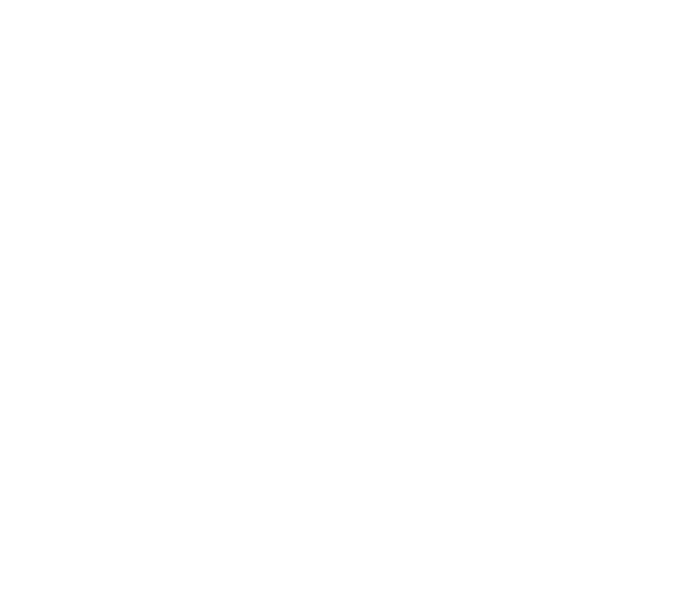

# What is Front-end<br>(web dev)?

---

# *Front-end Overview*

^ Whirlwind, whistlestop tour


---

# One Web
# Responsive Web Design
# Performance
# Frameworks

---

# *One Web*

^ device, connection, disabilities

---

## **One Web**
# Device

^ different input methods and capabilities

---

## **One Web**
# Connection

^ WiFi, cell signal

---

## **One Web**
# Disabilities

^ blind web users, old people, people with injury

---

# Progressive Enhancement

^ What is it?

---



^ HTML for structured content
CSS for presentation
JavaScript for behaviour

---

# HTML5, CSS3

^ HTML, CSS updating, changing
modular

---

# Pre- and post-processors

# CSS: Sass, Less
# JS: Coffescript, Typescript

^ Always compiles into CSS or JS
that's all that browsers read
Command line (or task runner: more on that later)

---

# *Responsive Web Design*

^ What is it?
What are the three bits?

---

## Responsive Web Design

# fluid grid
# flexible images
# media queries

---

# fluid grid

```css
.half {
  width: 50%;
}
```

^ when specifying widths of containers

---

# flexible images

```css
img {
  max-width: 100%;
  height: auto;
}
```

^ to let your images shrink to their containers
`srcset`, `picture`: save data


---

# media queries

```css
@media (min-width: 60em) {
  /* adjust stuff */
}
```

^ like font size and layout
breakpoints

---

# Mobile First

^ What is it?
content, design, and development
mobile gives us the strongest set of constraints

---

# *Performance*

^ What is it?

---

# latency<br>harsher than<br>bandwidth

^ round trip time vs download speed

---

# Inline, Internal, and External CSS

---

# Inline

```html
<p style="color: red;">Help!</p>
```

---

# Internal

```html
<style>
	p { color: red; }
</style>
```

---

# External

```html
<link rel="stylesheet" href="style.css" />
```

---

# Inline, Internal, and External JS

---

# Inline

```html
<p onClick="help()">Help!</a>
```

---

# Internal

```html
<script>console.log('Help!');</script>
```

---

# External

```html
<script src="help.js"></script>
```

---

# Which method is best?

^ Pros and Cons

---

# External is best

# modular, reusable,<br>more performant

^ easier to write
support
send to user

---

# Concatenation
# Minification
# Gzip

^ What is each
Why good?
How to do?

---

# Grunt
# Gulp
# npm scripts

^ JavaScript task runners
Like CLI, but lots of options

---

# *Frameworks*

^ Pros and Cons

---

# Frameworks: Pros

^ * can make complex things simpler
* often well maintained and well tested
* fast start up

---

# Frameworks: Cons

^ * add a dependency to your project
* can be overkill for the problem you are trying to solve
* can be painful to upgrade
* can have a steep learning curve
* are solving someone else's problem, not yours

---

# Roll your own framework, but borrow

# Bootstrap, Foundation
# Sites you like

^ How to start building your own?

---

# fef.projectcodex.co

---

# Front-end Style Guides
# Atomic Design

---

# *What next?*
